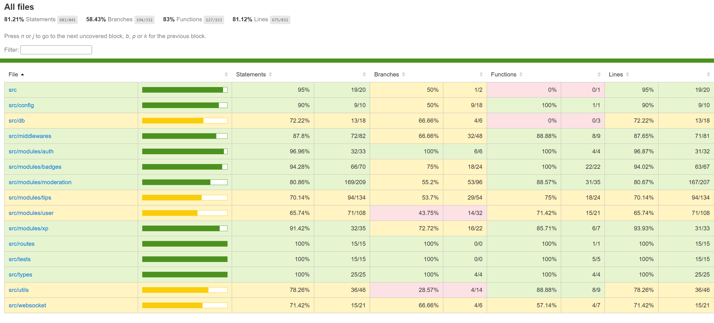

# Tests Backend

## Vue d'ensemble

Le backend dispose de **102 tests** repartis en deux categories :
- **Tests unitaires** - Testent les composants de maniere isolee
- **Tests d'integration** - Testent les flux complets avec la base de donnees

## Lancer les tests

**Important** : Les tests doivent etre lances depuis la **racine du projet** car ils utilisent Docker et accedent a la base de donnees de test dans le conteneur.

```bash
# Depuis la racine du projet
npm run backend:test              # Tous les tests
npm run backend:test:coverage     # Avec rapport de couverture
```

Les commandes ci-dessus :
1. Lancent Docker Compose
2. Entrent dans le conteneur backend
3. Executent les tests avec acces a la DB de test

## Structure des tests

```
src/tests/
├── integration/
│   ├── auth.integration.test.ts
│   ├── tips.integration.test.ts
│   ├── moderation.integration.test.ts
│   ├── xp.integration.test.ts
│   ├── badges.integration.test.ts
│   └── ping.test.ts
├── unit/
│   ├── controller/
│   ├── middleware/
│   ├── repository/
│   ├── service/
│   ├── utils/
│   └── websocket/
├── jest.setup.ts
└── prisma.helpers.ts
```

## Modules testes

### Moderation 
- Approbation/rejet de tips avec attribution XP
- Resolution de reports
- Promotion/demotion d'utilisateurs
- Statistiques et historique

### XP
- Attribution d'XP
- Promotions automatiques de grades
- Progression utilisateur
- Leaderboard

### Badges
- Verification conditions de badges
- Attribution avec bonus XP
- Calcul de progression
- Multi-badges flow

### Auth & Users
- Inscription/connexion
- Tokens JWT (access/refresh)
- Middleware d'authentification
- Autorisations par role

### Middlewares
- Validation Zod
- Gestion d'erreurs
- Rate limiting

## Coverage

### Obtenir le rapport de couverture

```bash
npm run backend:test:coverage
```

Le rapport est genere dans `backend/coverage/`.

### Voir le rapport en mode web

```bash
cd backend/coverage/lcov-report
# Ouvrir index.html dans un navigateur
```

Le rapport HTML interactif permet de :
- Voir les lignes couvertes/non couvertes
- Naviguer dans les fichiers
- Identifier les branches non testees

### Coverage actuel

**Coverage global : 81.21%**



## CI/CD

Comme mentionne dans le README, une **pipeline CI** a ete mise en place qui :

1. **Lance les tests automatiquement** sur chaque push/PR
2. **Verifie le linter** (ESLint)
3. **Verifie la compilation TypeScript** (tsc)

La CI garantit que le code mergé :
- Passe tous les tests
- Respecte les conventions de code
- Compile sans erreurs

## Technologies utilisees

- **Jest** - Framework de test
- **Supertest** - Tests HTTP
- **ts-jest** - Support TypeScript
- **Prisma** - Base de donnees de test

## Setup des tests

Le fichier `jest.setup.ts` configure :

1. **Mock bcrypt** - Accelere les tests de hashage
   ```typescript
   jest.mock('bcrypt', () => ({
     hashSync: jest.fn((p) => `hashed:${p}`),
     compareSync: jest.fn((a, b) => `hashed:${a}` === b),
   }));
   ```

2. **Reset DB** - Nettoie et migre la DB de test avant les tests

3. **Variables d'environnement** - Charge `.env.test`

## Helpers de test

`prisma.helpers.ts` fournit des fonctions utilitaires :

```typescript
clearUsers()              // Nettoie les users
clearTips()              // Nettoie les tips
clearModerationData()    // Nettoie donnees moderation
seedBadges()            // Cree les badges de base
disconnectPrisma()      // Ferme la connexion
```


## Isolation des tests
Chaque test est independant grace au cleanup `beforeEach`/`afterEach`.

## Nommage naturel
Les tests utilisent des noms en francais naturel :
```typescript
it('approuve un tip et donne de xp', ...)
it('erreur si pas moderateur', ...)
```

## Tests realistes
Les tests d'integration utilisent la vraie DB et les vraies routes HTTP.

## Mocks intelligents
Les dependances lentes (bcrypt) sont mockees, mais la logique metier reste testee.
